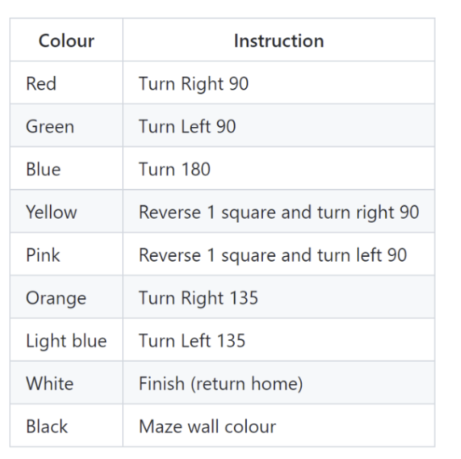

# Final Project - Autonomous Path Finding Buggy

## Welcome ! :wave:

## Specification

The principal objectives for this project were for the device to:

1. Navigate towards a coloured card and stop before impact 
2. Read the card colour 
3. Interpret the colour and perform the appropriate navigation instruction 
4. When the final card is reached, navigate to the start 
5. Handle exceptions and return to start if final card cannot be found

## Functionality
- Buggy undergoes a callibration routine so can adjust to the ambient light levels and adjust its
turn duration for different floor surfaces.
- After callibration, buggy moves off and performs different actions on detecting different coloured cards:

### Actions which buggy must perform on seeing each coloured card

## User Instructions

### Calibration Instructions
The device must be calibrated after switching the device on. This is done by pressing the 2 buttons labelled RF2 and RF3 on the clicker board.

Calibration consists of:
- Reading the ambient light levels in the room of the maze
- Adjusting the turn duration of the buggy (which varies depending on the surface it sits on)

After calibration, the buggy will attempt to reach the end of the maze!

## Developer Instructions :computer:

### TLDR Setup guide: :hammer:
- Clone the repository to your local machine using git clone (https url)
- Create a new project in MPLAB X IDE, e.g. 'final project.X'
- Add all existing .c and .h files to the project
- Add any build and distribution files to the .gitignore file.
- Create a new branch for the feature you are working on, e.g. feature/detecting_pink_card

### Flow chart representing buggy actions

### Hardware components and their corresponding files
The main components on the buggy are 4 DC motors, an RGBC light sensor and a tricolour LED. The files controlling their operation are are dc_motor, color and tricolorLED followed by the .c and .h file extensions.

Furthermore, the clicker2 board is the programmed microcontroller. It has 2 buttons which are used as inputs for calibration.

#### dc_motor.c and dc_motor.h
The left and right motors are controlled separately.

Attributes of each of the left and right motors are:
- power: controls the speed of the motor
- direction: 1 for forwards, 0 for reverse
- brakemode: 1 for slow decay, 0 for fast decay

To make the buggy turn left, the left motor's direction is set to 0 and the right motor's is set to 1. The motor turns in bursts. The global variable turnDuration is set to change the duration of each burst and hence the angle turned through in one burst. Small alterations to this variable can be made during callibration (see Calibration Instructions above).

##### FAQ: Why are the motor turns in bursts?
The motor's turn angles are more repeatable when the motor turns in bursts rather than in one continuous motion.

#### color.c and color.h
The light sensor is sent commands and read from via an I2C serial interface. It contains 4 channels for red, green, blue and clear.

##### FAQ: How are the coloured cards detected?

- With the tricolor LED white light turned on, the buggy's colour sensor was pressed against all of the coloured cards individually.
- The absolute percentage change of RGBC colour sensor values from ambient RGBC values were then measured using a serial monitor.
- These values are stored in separate thresholdAbsolutePercentageChangeOf_ADC_ColourSensorValues structs for each coloured card.
- Measurements of the RGBC values are made every 0.1 seconds while the buggy is driving forward. These are compared with both the previous RGBC values and ambient to perform a simple check to determine if a card is present. If a card is present, a more complicated (and hence computationally expensive) check is performed to determine which colour card is present. The buggy then performs an action according to the coloured card.

During calibration, the ambient light levels are read and stored in a global ADC_RGBC_ColourValues struct called ambient_ADC_values.

#### tricolorLED.c and tricolorLED.h
Controls the colour of the tricolorLED. This is used mostly for feedback to user after each calibration step. 

### Github branches
- The code in branch called 'main' is what is run on the microcontroller. It should therefore be branched off to create any new features.
- The branch called 'get_ADC_serial_readout' is run to display the colour sensors RGBC ADC values to the serial monitor through use of a program like Realterm.

#### Downloading serial terminal software

To receive data from the PIC, download the appropriate software for your operating system:

Windows - https://realterm.i2cchip.com/Realterm_3.0.1.44_setup.exe

MAC - https://pbxbook.com/other/mac-ser.html

For Realterm users:
"The serial port can be set up from the Port tab as shown below and settings are updated when the Change button is clicked. The Baud should be 9600 to start with and no partity, 8 data bits and 1 stop bit. In this case the USB Serial Port for the clicker 2 is on port 4, but it could be any number. If you want to check what the number should be on your system open up Device Manager in Windows and look under "Ports (COM & LPT)". You are looking for the item called "USB Serial Port (COMx)" where x is the port number." (Hopper, Paul - Lab 5 - Serial communication README.md)

### Docstrings: :information_desk_person:
- All files should have a description of its purpose
- All functions should contain its purpose, input parameters, and what it returns
- All structures defined in each header file should have a description of the information it possesses

### Limitations and Future Work
- Buggy cannot find its route back without the coloured cards. The buggy should retrace its steps on reaching the white coloured card; it can do this storing the time travelled before each turn and the type of turn performed.
- Detection of orange and light blue colours should be more consistent
- Buggy must currently drive into the wall to detect different colours. It should be able to stop a few
centrimetres away from the wall.

## Presentation
https://imperiallondon-my.sharepoint.com/:p:/g/personal/cbl20_ic_ac_uk/EU4X-caz2XhHtWvu7GrGB6kBolhDw74u35yMXFaxyCS9mw?e=T5jO33